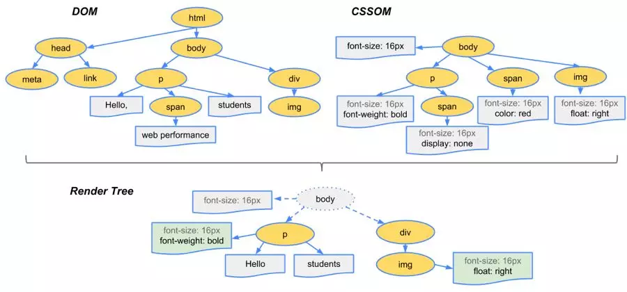
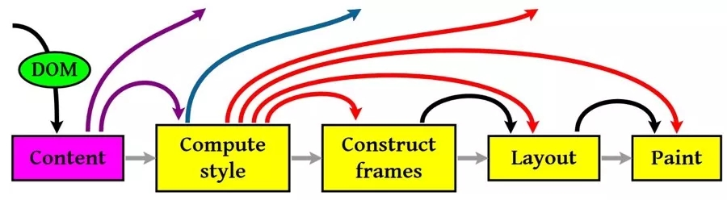

## 前端相关知识整理1——web性能优化

web性能优化主要分为2个大方向

+ 传输
+ 渲染

### 传输方面

传输的中心思想就是加快传输效率，减少等待时长。即更少的请求次数、更小的文件、更多的请求链接。

请求响应过程


可简化为如下5步。


1. **DNS查询**

   1. 减少DNS查询次数(减少不必要的新域名)

   2. 页面解析与DNS解析并行(`DNS Prefetech`)

      ```html
      <meta http-equiv="x-dns-prefetch-control" content="on">
      <link rel="dns-prefetch" href="...">
      ...
      ```

2. **连接服务器**

   **原因**：

   + 浏览器对于同一域名发起的并发线程有数量限制，各浏览器不同，但均小于10。(chrome为6个)

   + web服务器忙

   **解决**

   1. 缩短连接等待时间

      服务器端：提升服务器并发请求处理能力；

      运维端：使用CDN优化访问路径。

   2. 提高浏览器连接并发数

      将资源分散到不同域名下(注意：需要和 **DNS Prefetch** 并用)。

3. **发送请求**

   1. 减少cookies数据的使用

   2. 将无需cookies的资源放置在其他域名下

      客户端cookies数据只会回传给当前域名或指定域名下的请求，其他域名的请求不会携带发送。

4. **等待服务器响应 (服务端优化)**

   1. 数据库缓存
   2. 动态数据静态化
   3. 异步请求处理
   4. 分布式集群(Nginx负载均衡)
   5. ……

5. **下载响应数据**

   1. JS / CSS 数据最小化方法(GuIp，webpack)；

   2. 使用 **gzip** 压缩

      ```javascript
      data.pipe(zlib.createGzip()).pipe(response);
      // data Buffer文件
      // zilb nodejs核心模块
      // pipe 管道
      // 所有主流浏览器自带gzip解压缩方法
      ```
      
    3. 降低不必要的图片质量和尺寸

6. **减少请求次数**

   1. 减少当前页面请求次数——合并请求
      + CSS Sprites
      + 字体图标
      + 图片base64转码打包(小图片)
      + JS / CSS文件打包
      + 禁止空`src`属性，因为也会发出请求
   2. 减少后续页面请求次数——缓存响应数据
      + 使用 Expires 设置缓存过期的时间点
      + 使用Cache-Control 设置缓存时长

---

### 渲染方面

渲染方面，现代浏览器内核中JS引擎和渲染引擎是互斥的，即当JS引擎工作时，渲染引擎挂起；渲染引擎工作时，JS引擎挂起。但相互间不影响资源加载。

浏览器页面渲染流程：

+ 浏览器对文件进行从上到下解析;
+ 并非全部解析完成后，才进行页面渲染，而是解析一部分后便开始页面渲染；
+ 生成Dom-tree和CSS-tree，合并成Render-tree，进行页面渲染；
+ 渲染后，根据后续解析情况会触发重构和重绘操作，要尽量减少浏览器重构。






1. **将样式表置顶**

   经样式表(CSS)放在网页的HEAD中会让网页显得加载速度更快，因为这样做可以使浏览器逐步加载已将下载的网页内容。

2. **避免CSS表达式**

   CSS表达式可以动态的设置CSS属性，在IE5-IE8中支持，其他浏览器中表达式会被忽略。

   CSS表达式的问题在于它被重新计算的次数远比我们想象的要多，不仅在网页绘制或大小改变时计算，即使我们滚动屏幕或者移动鼠标的时候也在计算，因此我们还是尽量避免使用它来防止使用不当而造成的性能损耗。

3. **用`<link>`代替`@import`**

   避免使用`@import`的原因很简单，因为它相当于将CSS放在网页内容底部。

   + 从属关系区别

      `@import`是 CSS 提供的语法规则，只有导入样式表的作用；  
      link是HTML提供的标签，不仅可以加载 CSS 文件，还可以定义 RSS、rel 连接属性等。

   + 加载顺序区别

      加载页面时，link标签引入的 CSS 被同时加载；  
      `@import`引入的 CSS 将在页面加载完毕后被加载。

   + 兼容性区别

      `@import`是 CSS2.1 才有的语法，故只可在 IE5+ 才能识别；  
      link标签作为 HTML 元素，不存在兼容性问题。

   + DOM可控性区别

      可以通过 JS 操作 DOM ，插入link标签来改变样式；  
      由于 DOM 方法是基于文档的，无法使用`@import`的方式插入样式。

   在《CSS权威指南》中写道：  
   `@import`一定要写在除`@charset`外的其他任何 CSS 规则之前，如果置于其它位置将会被浏览器忽略，而且，在`@import`之后如果存在其它样式，则`@import`之后的分号是必须书写，不可省略的。

4. **避免使用Filters**

   是IE5 - IE8中支持，这种滤镜的使用会导致图片在下载的时候阻塞网页绘制，另外使用这种滤镜会导致内存使用量的问题。IE9中已经不再支持

5. **将脚本置底**

   HTTP/1.1 specification建议浏览器对同一个host-name不要超过两个并行下载连接， 所以当你从多个domain下载图片的时候可以提高并行下载连接数量。但是当脚本在下载的时候，即使是来自不同的host name浏览器也不会下载其他资源，因为浏览器要在脚本下载之后依次解析和执行。

   因此对于脚本提速，我们可以考虑以下方式，

   + 把脚本置底，这样可以让网页渲染所需要的内容尽快加载显示给用户。
   + 现在主流浏览器都支持`defer`关键字，可以指定脚本在文档加载后执行。
   + HTML 5中新加了`async`关键字，可以让脚本异步执行。

6. **减少DOM访问**

   通过JavaScript访问DOM元素没有我们想象中快，元素多的网页尤其慢，对于JavaScript对DOM的访问我们要注意

   + 缓存已经访问过的元素
   + Off-line更新节点然后再加回DOM Tree
   + 避免通过JavaScript修复layout

7. **不要在HTML中缩放图片**

   不要通过图片缩放来适应页面，如果你需要小图片，就直接使用小图片吧。

8. **减少iframe数量**

   使用iframe要注意理解iframe的优缺点

   优点

   + 可以用来加载速度较慢的内容，例如广告。
   + [安全沙箱保护](http://www.html5rocks.com/en/tutorials/security/sandboxed-iframes/)。浏览器会对iframe中的内容进行安全控制。
   + 脚本可以并行下载

   缺点

   + 即使iframe内容为空也消耗加载时间
   + 会阻止页面加载
   + [没有语义](http://www.w3schools.com/html/html5_semantic_elements.asp)

   ---

   ### 编码优化

   编码优化，指的就是 在代码编写时的，通过一些 最佳实践，提升代码的执行性能。通常这并不会带来非常大的收益，但这属于 程序猿的自我修养，而且这也是面试中经常被问到的一个方面，考察自我管理与细节的处理。

   1. **数据读取**

   通过作用域链 / 原型链 读取变量或方法时，需要更多的耗时，且越长越慢；

   对象嵌套越深，读取值也越慢；

   + 尽量在局部作用域中进行 **变量缓存**；
   + 避免嵌套过深的数据结构，**数据扁平化** 有利于数据的读取和维护；

   2. **循环**

   循环通常是编码性能的关键点；

   代码的性能问题会再循环中被指数倍放大；

   + 尽可能 **减少循环次数**；
   + 减少遍历的数据量；
   + 完成目的后马上结束循环；
   + 避免在循环中执行大量的运算，避免重复计算，相同的执行结果应该使用缓存；
   + JS中使用 倒序循环 会略微提升性能；
   + 尽量避免使用 `for-in` 循环，因为它会枚举原型对象，耗时大于普通循环；

   3. **条件流程性能**

   **Map / Object > switch > if-else**
   
```javascript
   // 使用 if-else

   if (type === 1) {
   } else if (type === 2) {
   } else if (type === 3) {
   }

   // 使用 switch

   switch (type) {
    case 1:
     break
    case 2:
     break
    case 3:
     break
    default:
     break
   }

   // 使用 Map
   const map = new Map([
    [1, () => {}],
    [2, () => {}],
    [3, () => {}]
   ])
   map.get(type)()

   // 使用 Objext
   const obj = {
    1: () => {},
    2: () => {},
    3: () => {},
   }

   obj[type]()
```

---

### CSS优化

   **层级扁平**，避免过于多层级的选择器嵌套；

   **特定的选择器** 好过一层一层查找: `.xxx-child-text{}` 优于 `.xxx .child .text{}`；

   **减少使用通配符与属性选择器**；

   **减少不必要的多余属性**；

   使用 **动画属性** 实现动画，动画时脱离文档流，开启硬件加速，优先使用 CSS 动画。

---

### HTML 优化

   **减少 Dom 数量**，避免不必要的节点或嵌套；

   **避免**``**空标签**，能减少服务器压力，因为 `src` 为空时，浏览器仍然会发起请求

+ IE 向页面所在的目录发送请求；
+ Safari、Chrome、Firefox 向页面本身发送请求；
+ Opera 不执行任何操作。

   图片提前 **指定宽高** 或者 **脱离文档流**，能有效减少因图片加载导致的页面回流；

   **语义化标签** 有利于 `SEO` 与浏览器的解析时间；

   **减少使用** `table` 进行布局，避免使用`<br />`与`<hr />`；

---

### 首屏渲染优化

1.  **CSS / JavaScript** 分割
   + 使首屏依赖的文件体积最小，内联首屏关键 **CSS / JavaScript**；
   + 非关键性的文件尽可能的 **异步加载和懒加载**，避免阻塞首页渲染；
   + 使用`dns-prefetch` / `preconnect` / `prefetch` / `preload`等浏览器提供的资源提示，加快文件传输；
2. 谨慎控制好 **Web字体**
   + 控制字体包的加载时机；
   + 如果使用的字体有限，那尽可能只将使用的文字单独打包，能有效减少体积；
   + 合理利用 `Localstorage` / `server-worker` 等存储方式进行 **数据与资源缓存**；
   + **分清轻重缓急**
     + 重要的元素优先渲染；
     + 视窗内的元素优先渲染；
3. **服务端渲染(SSR)**
   + 减少首屏需要的数据量，剔除冗余数据和请求；
   + 控制好缓存，对数据/页面进行合理的缓存；
   + 页面的请求使用流的形式进行传递；

---

### 优化用户感知

   + 过渡效果

   + 利用一些动画过渡效果，能有效减少用户对卡顿的感知；

   + 骨架屏

     骨架屏是防止“白屏”和“菊花”所出现的解决方案。  
     即采用简约的方式布局，创造出独一无二的简约风格，来提高用户体验

   + 动画帧数

     动画帧数尽量保证在 **30帧** 以上，低帧数、卡顿的动画宁愿不要；

   + JS执行时间

     JS 执行时间避免超过 **100ms**，超过的话就需要做  

     + 寻找可缓存的点；
     + 任务的 分割异步 或 web worker 执行

---

### 参考资料

+ [毫秒必争，前端网页性能最佳实践](https://www.cnblogs.com/developersupport/p/webpage-performance-best-practices.html)
+ [Best Practices for Speeding Up Your Web Site](https://developer.yahoo.com/performance/rules.html?guccounter=1)
+  [由link和@import的区别引发的CSS渲染杂谈](http://www.cnblogs.com/KilerMino/p/6115803.html)

