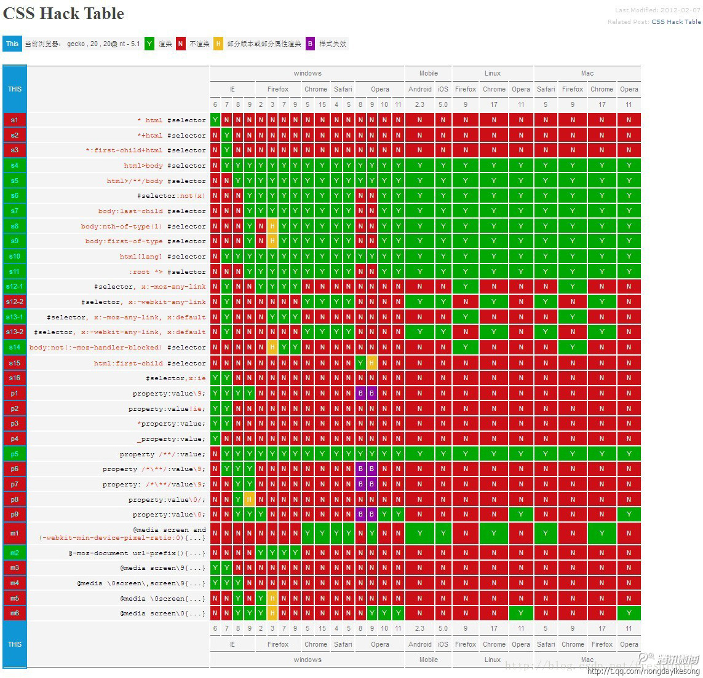

## 前端相关知识整理2——浏览器兼容问题

前端三大问题

+ 浏览器兼容问题
+ 浏览器安全问题
+ web性能优化

---

### 关于浏览器的说明

各主流浏览器内核的渲染引擎的不同，造成不同浏览器对于网页的解析造成一定出入。

其中，尤其是IE浏览器以垄断地位，更新慢、bug多、不遵守`W3C`提出的规范，一直到`IE9`才变得好起来。

现代浏览器，逐渐认识到统一标准的重要性，并且以开源浏览器逐渐为主流。([StatCounter 浏览器统计数据](http://gs.statcounter.com/))

|   浏览器    |        渲染引擎         |          JS引擎           |
| :---------: | :---------------------: | :-----------------------: |
|   **IE**    |       **Trident**       |        **Chakra**         |
|  **Edge**   |      **Edge-HTML**      |        **Chakra**         |
| **Firefox** |        **Gecko**        |        **Mozilla**        |
| **Safari**  |       **WebKit**        | **Nitro（SquirrelFish）** |
| **Chrome**  |   **WebKit / Blink**    |          **V8**           |
|  **Opera**  | **WebKitt** / **Blink** |        **Carakan**        |


#### 渲染引擎

渲染引擎负责负责对网页语法的解释（如HTML、XML等）并渲染网页（CSS）。渲染引擎决定了浏览器如何显示网页的内容以及页面的格式信息。
下面介绍一下主流的渲染引擎。

> + **Trident**（IE）
>  国内许多双核浏览器的其中一核便是Trident，也就是我们所说的兼容模式。
>   如IE、腾讯TT、猎豹浏览器、360极速浏览器、百度浏览器等都使用了Trident。
>   在Win10发布后，微软将其内置浏览器命名为Edge，Edge的最显著特点就是新内核Edge-HTML。
>+ **Gecko**（Firefox）
>   Gecko的最大特点便是完全开源，开发程度很高。可惜近几年开始没落了，如打开速度过慢，猪一样的对友Flash以及神一样的对手Chrome。
> + **WebKit**（safari）
>   大名鼎鼎的WebKit内核是苹果公司开发的。像Opera、Chrome早期都使用的是WebKit作为浏览器内核。
>   虽然Chrome早已换为Blink内核，但是当提到WebKit时，大家还是会自动联想到Chrome（苹果已经哭晕在厕所）。
> + **Blink**（Chrome）
>   2013年，Google 宣布将在未来的 Google Chrome/Chromium 中使用基于 WebKit 的 fork Web 渲染引擎：Blink。同时 Opera 表示也将跟进 Google Chrome/Chromium 的步伐。
>   且目前大部分国内浏览器最新版本的内核也都改为了Blink。

#### JS引擎

JavaScript引擎是一个专门处理JavaScript脚本的虚拟机，一般会附带在网页浏览器之中。即负责对JavaScript脚本的解释与执行。

> + **V8**（Chrome）
>   谷歌公司开发的V8浏览器基于C++，在运行JavaScript之前，相比其它的JavaScript的引擎转换成字节码或解释执行，V8将其编译成原生机器码（IA-32, x86-64, ARM, or MIPS CPUs），并且使用了如内联缓存（inline caching）等方法来提高性能。有了这些功能，JavaScript程序在V8引擎下的运行速度媲美二进制程序。
>   NodeJS其实就是封装了V8。
> + **Chakra** （IE）
>   Chakra 中文译名为查克拉（火影乱入）。虽然新版的IE（IE9及之后的版本）以及Edge使用的是Chakra，但老版的IE仍然使用的是Jscript。
> + **Nitro（SquirrelFish）**（Safari）
>   2008年6月2日，WebKit开发团队声明了SquirrelFish，一个能极大地提升Safari解释脚本速度的JavaScript引擎。
>   SquirrelFish是基于寄存器、直接线程的高级字节码引擎。
> + **Carakan**（Opera）
> + **Mozilla**（firefox）

#### 总结

一个典型的浏览器有一个渲染引擎和一个独立的JavaScript引擎。这样JavaScript引擎能够被更方便的测试、重新生成或者在另一些项目中使用。例如Carakan被用在Presto中，Nitro被用在WebKit中，SpiderMonkey被用在Gecko中，KJS被用在KHTML中，Rhino默认不包含任何布局引擎。但还有其他组合，例如V8与WebKit被用于Chrome浏览器中。JavaScript引擎能为程序员提供部分操作浏览器的功能（网络、DOM、外部事件、HTML 5视频、canvas和存储）。

---

### 关于 `hasLayout` 的说明

`Layout`是一个 `IE/Win` 的私有概念，它决定了一个元素如何显示以及约束其包含的内容、如何与其他元素交互和建立联系、如何响应和传递应用程序事件/用户事件等。

这种渲染特性可以通过某些 CSS 属性被不可逆转地触发。而有些 HTML 元素则默认就具有“`layout`”。 微软的开发者们认为元素都应该可以拥有一个“属性(`property`)”(这是面向对象编程中的一个概念)，于是他们便使用了 `hasLayout`，这种渲染特性生效时也就是将 `hasLayout `设成了 true 之时。


当我们说一个元素“得到 `layout`”，或者说一个元素“拥有 `layout`” 的时候，我们的意思是指它的微软专有属性 `hasLayout `为此被 设为了 `true `。一个“`layout`元素”可以是一个默认就拥有 `layout `的元素或者是一个通过设置某些 CSS 属性得到 `layout `的 元素。

而“无`layout`元素”，是指 `hasLayout `未被触发的元素，比如一个未设定宽高尺寸的干净 div 元素就可以做为一个“无`layout`祖先”。

给 一个默认没有 `layout `的元素赋予 `layout `的方法包括设置可触发 `hasLayout = true` 的 CSS 属性。参考默认 `layout `元素以及这些属性列表。没有办法设置 `hasLayout = false` ， 除非把一开始那些触发 `hasLayout = true` 的 CSS 属性去除。


但 Windows上的IE使用布局概念减少它的处理开销，在IE中不是全部的元素都可以控制自己的尺寸和定位。

当然，这并不是没有原因的，官方给出的解释是：这样会在IE中导致很大的性能问题，IE开发团队决定只将布局应用于实际需要它的那些元素，这样就可以充分地减少性能的开销。

#### 拥有`haslayout`的标签

如果一个元素“没有拥有布局”，那么它的尺寸和位置由最近拥有布局的祖先元素控制。 ( 拥有了布局的元素会表现会矩形 )

在默认情况下，IE中本身自己就拥有布局的元素包括：

|        |        |        |        |
| :----: | :----: | :----: | :----: |
| body | html(标准模式) | table | tr |
| td | hr | button | iframe |
| input | select | img | textarea |
| embed | object | applet | marquee |

#### 设置 `haslayout`

布局的概念是IE特有的，它不是CSS属性，但是可以通过JS获取到`hasLayout`，这是一个只读属性，不可以设置，所以我们不能用JS来设置这个属性。

但是我们可以通过设置一些CSS属性来使没有拥有布局的元素自动拥有布局，我们可以通过设置下面这些属性：

 ```css
float: left | right; // IE 常见bug很多都因为元素设置了浮动而触发haslayout产生
width: any; // 非 auto
height: any; // 非 auto
zoom: any; // 非 auto，用 zoom 来触发 haslayout 的扩展内容
writing-mode: tb-rl;
display: inline-block;
position: absolute; // 可能引发新问题
 ```

在IE7中以下的属性也成了布局触发器

 ```css
overflow、overflow-x、overflow-y: hidden、scroll、auto
min-width、min-height: any
max-widht、max-height: 除了none以外的任何值
position: fixed
 ```
==IE8已经放弃了`hasLayout`属性==

`zoom: 1; `是很不错的触发方法，不会改变原来的任何式样，而且仅仅是IE可以识别，但是唯一的坏处就是他不能通过W3C。

#### 重置 `haslayout`

```css
width, height (设为 "auto")
max-width, max-height (设为 "none")(在 IE7 中)
position (设为 "static")
float (设为 "none")
overflow (设为 "visible") (在 IE7 中)
zoom (设为 "normal")
writing-mode (从 "tb-rl" 设为 "lr-t")
```

设置` display: inline-block; `然后再设置回原始的 `display `属性,这样不会移除 `layout`，我们就可以达到设置 `layout `而不使用IE的条件注释的目的。

eg:

 ```css
div { display: inline-block; }   
div { display: block; } /* 分别在两段 css 块中设置 */   
 ```

注意：

1. **需要没有其他属性激活haslayout的前提下**
2. 当用`inline-block`激活了`haslayout` 属性时，就算在一条独立的规则中**覆盖**这个属性为`block`或`inline`，`haslayout `这个标志位也不会被重置为 `false`。

---

### 关于 CSS Hack

#### 什么是CSS Hack

由于不同厂商的流览器或某浏览器的不同版本（如IE6 - IE11,Firefox/Safari/Opera/Chrome等），对CSS的支持、解析不一样，导致在不同浏览器的环境中呈现出不一致的页面展现效果。这时，我们为了获得统一的页面效果，就需要针对不同的浏览器或不同版本写特定的CSS样式，我们把这个针对不同的浏览器/不同版本写相应的CSS code的过程，叫做CSS Hack。

#### CSS Hack 原理

由于不同的浏览器和浏览器各版本对CSS的支持及解析结果不一样，以及CSS优先级对浏览器展现效果的影响，我们可以据此针对不同的浏览器情景来应用不同的CSS。

#### CSS Hack 分类

CSS Hack大致有3种表现形式：

+ CSS属性前缀法
+ 选择器前缀法
+ IE条件注释法（即HTML头部引用if IE）

CSS hack书写顺序，一般是将适用范围广、被识别能力强的CSS定义在前面。 

因为优先级相同且相冲突的属性设置后一个会覆盖掉前一个，所以书写的次序是很重要的。

##### CSS属性前缀法

属性前缀法是在CSS样式属性名前加上一些只有特定浏览器才能识别的hack前缀，以达到预期的页面展现效果。

IE浏览器各版本 CSS hack 对照表

|    hack    |          写法          | IE6(S)(Q) | IE7(S)(Q) | IE8(S)(Q) | IE9(S)(Q) | IE10(S)(Q) | Firefox | Opera | Safari |
| :--------: | :--------------------: | :-------: | :-------: | :-------: | :-------: | :-------: | :-------: | :-------: | :-------: |
|     *      |         *color         |     Y     |     Y     |   N(Y)    |   N(Y)    |    N(Y)    |     N      |     N      |     N      |
|     +      |         +color         |     Y     |     Y     |   N(Y)    |   N(Y)    |    N(Y)    |     N      |     N      |     N      |
|     -      |         -color         |     Y     |     N     |     N     |     N     |     N      |     N      |     N      |     N      |
|     _      |         _color         |     Y     |   N(Y)    |   N(Y)    |   N(Y)    |     N      |     N      |     N      |     N      |
|     #      |         #color         |     Y     |     Y     |   N(Y)    |   N(Y)    |    N(Y)    |     N      |     N      |     N      |
|     \0     |      color:red\0       |     N     |     N     |   Y(N)    |   Y(N)    |    Y(N)    |     N      |     N      |     N      |
|    \9\0    |     color:red\9\0      |     N     |     N     |     N     |   Y(N)    |    Y(N)    |     N      |     N      |     N      |
| !important | color:blue !important; |     N     |   Y(N)    |   Y(N)    |   Y(N)    |     Y      |     Y      |     Y      |     Y      |


说明：在标准模式中 

+ "-"减号是IE6专有的hack 
+ "\9" IE6/IE7/IE8/IE9/IE10都生效 
+ "\0" IE8/IE9/IE10都生效，是IE8/9/10的hack 
+ "\9\0" 只对IE9/IE10生效，是IE9/10的hack 

注意: 

*+html 对IE7的兼容 必须保证HTML顶部有如下声明： 

```html
<!DOCTYPE HTML PUBLIC "-//W3C//DTDHTML 4.01 Transitional//EN"　"http://www.w3.org/TR/html4/loose.dtd">
```

##### 选择器前缀法

选择器前缀法是针对一些页面表现不一致或者需要特殊对待的浏览器，在CSS选择器前加上一些只有某些特定浏览器才能识别的前缀进行hack。

+ *html *前缀只对IE6生效
+ +html *+前缀只对IE7生效
+ @media screen\9{...}只对IE6/7生效
+ @media \0screen {body { background: red; }}只对IE8有效
+ @media \0screen\,screen\9{body { background: blue; }}只对IE6/7/8有效
+ @media screen\0 {body { background: green; }} 只对IE8/9/10有效
+ @media screen and (min-width:0\0) {body { background: gray; }} 只对IE9/10有效
+ @media screen and (-ms-high-contrast: active), (-ms-high-contrast: none) {body { background: orange; }} 只对IE10有效



##### 条件注释法

这种方式是IE浏览器专有的Hack方式，微软官方推荐使用的hack方式。

```css
/* 只在IE下生效 */
[if IE]
/* 这段文字只在IE浏览器显示 */
[endif]

/* 只在IE6下生效 */
[if IE 6]
/* 这段文字只在IE6浏览器显示 */
[endif]

/* 只在IE6以上版本生效 */
[if gte IE 6]
/* 这段文字只在IE6以上(包括)版本IE浏览器显示 */
[endif]

/* 只在IE8上不生效 */
[if ! IE 8]
/* 这段文字在非IE8浏览器显示 */
[endif]

/* 非IE浏览器生效 */
[if !IE]
/* 这段文字只在非IE浏览器显示 */
[endif]
```

#### CSS hack利弊

一般情况下，我们尽量避免使用CSS hack，但是有些情况为了顾及用户体验实现向下兼容，不得已才使用hack。比如由于IE8及以下版本不支持CSS3,而我们的项目页面使用了大量CSS3新属性在IE9/Firefox/Chrome下正常渲染，这种情况下如果不使用css3pie或htc或条件注释等方法时,可能就得让IE8-的专属hack出马了。使用hack虽然对页面表现的一致性有好处，但过多的滥用会造成html文档混乱不堪，增加管理和维护的负担。相信只要大家一起努力，少用、慎用hack，未来一定会促使浏览器厂商的标准越来越趋于统一，顺利过渡到标准浏览器的主流时代。抛弃那些陈旧的IE hack，必将减轻我们编码的复杂度，少做无用功。

---

### 兼容问题

1. **不同浏览器的标签默认的外补丁和内补丁不同**

   随便写几个标签，不加样式控制的情况下，各自的 `margin` 和 `padding` 差异较大。

   解决方案：CSS里  *

   备注：这个是最常见的也是最易解决的一个浏览器兼容性问题，几乎所有的CSS文件开头都会用通配符*来设置各个标签的内外补丁是0。

2. **块属性标签`float`后，又有横行的margin情况下，在IE6显示`margin`比设置的大**

   常见症状是IE6中后面的一块被顶到下一行

   解决方案：在`float`的标签样式控制中加入 `display:inline;` 将其转化为行内属性

   备注：我们最常用的就是 `div+css` 布局了，而`div`就是个典型的块属性标签，横向布局的时候我们通常都是用`div float`实现的，横向的间距设置如果用`margin`实现，这是个必然会碰到的兼容性问题。

4. **行内属性标签，设置`display:block`后采用`float`布局，又有横行的`margin`的情况，IE6间距bug（类似第二种）**

   IE6里的间距比超过设置的间距

   解决方案：在`display:block;`后面加入`display:inline;display:table;`

   备注：行内属性标签，为设置宽高，我们需要设置`display:block;`(除`input`标签比较特殊)。在用`float`布局并有横向的`margin`后，在IE6下，他就具有了块属性`float`后的横向`margin`的bug。不过因它本身就是行内属性标签，所以我们再加上`display:inline`的话，它的高宽就不可设了。这时候我们还需要在`display:inline`后面加入`display:talbe`。
   
3. **设置较小高度标签（一般小于10px），在IE6，IE7，遨游中高度超出自己设置高度**

   IE6、7和遨游里这个标签的高度不受控制，超出自己设置的高度
   
   解决方案：给超出高度的标签设置`overflow:hidden;`或者设置行高`line-height` 小于你设置的高度。
   
   备注：这一般出现在我们设置小圆角背景的标签里。出现这个问题的原因是IE8之前的浏览器都会给标签一个最小默认的行高的高度。即使你的标签是空的，这个标签的高度还是会达到默认的行高。
   
5. **图片默认有间距**

   几个`img`标签放在一起的时候，有些浏览器会有默认的间距，加上问题1中提到的通配符也不起作用。

   解决方案：使用`float`属性为`img`布局

   备注：因`img`标签是行内属性标签，所以只要不超出容器宽度，`img`标签都会排在一行里，但是部分浏览器的`img`标签之间会有个间距。去掉这个间距使用`float`是王道

6. **标签最低高度设置min-height不兼容**

   因为`min-height`本身就是一个不兼容的`CSS`属性，所以设置`min-height`时不能很好的被各个浏览器兼容

   解决方案：如果我们要设置一个标签的最小高度`200px`，需要进行的设置为：

   ```css
   {
     min-height: 200px;
     height: auto !important;
     height: 200px;
     overflow: visible;
   }
   ```

   备注：在`B/S`系统前端开时，有很多情况下我们有这种需求。当内容小于一个值（如`300px`）时。容器高度为`300px`；当内容高度大于这个值时，容器高度被撑高，而不是出现滚动条。这时候我们就会面临这个兼容性问题。

7. **无法设置IE浏览器滚动条颜色**

原样式设置：

```css
body {
   scrollbar-face-color: #f6f6f6;
   scrollbar-highlight-color: #fff;
   scrollbar-shadow-color: #eee;
   scrollbar-3dlight-color: #eee;
   scrollbar-arrow-color: #000;
   scrollbar-track-color: #fff;
   scrollbar-darkshadow-color: #fff;
}
```

解决方案：将`body`换成`html`

8. **定义1px左右高度的容器？**

解决方案：IE6下这个问题是因为默认的行高造成的，解决的方法也有很多，例如：`overflow: hidden; | zoom: 0.08; | line-height: 1px;`

9. **让层显示在FLASH之上**

解决方案：给FLASH设置透明

```html
<a href="http://www.chinaz.com/">:</a> 
<pre lang="html" line="1"> 
<param name="wmode" value="transparent" />
```

10. 在IE6下透明的png图片会带一个背景色

解决方案：

```css
background-image: url(icon_home.png);/* 其他浏览器 */
background-repeat: no-repeat;
_filter:progid:DXImageTransform.Microsoft.AlphaImageLoader(src='icon_home.png');/* IE6 */
_background-image: none; /* IE6 */
```

11. **禁止选取网页内容**

Firefox需要用CSS禁止，IE用JS禁止

解决方案：

```
IE: obj.onselectstart = function() {return false;}
Firefox: -moz-user-select:none;
```

12. **`float`的`div`闭合;清除浮动;自适应高度**

+ eg：

```html
<div id="floatA"></div>
<div id="floatB"></div>
<div id="NOTfloatC">
```

+ 这里的`NOTfloatC`并不希望继续平移，而是希望往下排。(其中`floatA、floatB`的属性已经设置为`float:left;`)
+ 这段代码在IE中毫无问题，问题出在Firefox。原因是`NOTfloatC`并非`float`标签，必须将`float`标签闭合。在`<divclass="floatB"><div class="NOTfloatC">`之间加上`<div class="clear">`这个div一定要注意位置，而且必须与两个具有`float`属性的`div`同级，之间不能存在嵌套关系，否则会产生异常。并且将`clear`这种样式定义为为如下即可：`.clear{clear:both;}`
+ 作为外部 `wrapper` 的 `div` 不要定死高度,为了让高度能自适应，要在 `wrapper` 里面加上 `overflow:hidden;` 当包含 `float` 的 `box` 的时候，高度自适应在IE下无效，这时候应该触发IE的 `layout` 私有属性用 `zoom:1;` 可以做到，这样就达到了兼容。

例如某一个`wrapper`如下定义：

```css
.colwrapper {
  overflow: hidden;
  zoom: 1;
  margin: 5px auto;
}
```

+ 对于排版,我们用得最多的`CSS`描述可能就是`float:left;`有的时候我们需要在n栏的`float div`后面做一个统一的背景,譬如:

```html
<div id="page">
	<div id="left"></div>
	<div id="center"></div>
	<div id="right"></div>
</div>
```

比如我们要将`page`的背景设置成蓝色,以达到所有三栏的背景颜色是蓝色的目的,但是我们会发现随着`left center right`的向下拉长,而`page`居然保存高度不变,问题来了,原因在于`page`不是`float`属性,而我们的`page`由于要居中,不能设置成`float`,所以我们应该这样解决：

```html
<div id="page">
  <div id="bg" style="float:left; width:100%;">
    <div id="left"></div>
    <div id="center"></div>
    <div id="right"></div>
	</div>
</div>
```

再嵌入一个`float left`而宽度是100%的`div`解决之。

+ 万能`float` 闭合(非常重要!)

将以下代码加入`Global CSS` 中,给需要闭合的`div`加上`class="clearfix"`即可,屡试不爽。

```css
/* Clear Fix */ 
.clearfix:after {
   content: "";
   display: block;
   height: 0;
   clear: both;
   visibility: hidden;
} 
.clearfix {
   display: inline-block;
} 
/* Hide from IE Mac */ 
.clearfix {
   display: block;
} 
/* End hide from IE Mac */ 
/* end of clearfix */
```

13. **`div`嵌套时 y轴上 `padding` 和 `marign` 的问题**

+ Firefox里 `y` 轴上 子`div` 到 父 `div` 的距离为 父 `padding` + 子 `marign`
+ IE里 `y` 轴上 子`div` 到 父 `div` 的距离为 父 `padding` 和 子 `marign` 里大的一个
+ Firefox里 `y` 轴上 父 `padding=0` 且 `border=0` 时，子 `div` 到 父 `div` 的距离为`0`，子 `marign` 作用到 父 `div` 外面


### 参考资料

+ [【前端】浅谈浏览器内核：渲染引擎、JS引擎](https://blog.csdn.net/ywj_justdoit/article/details/93775913)
+ [WEB前端开发人员须知的常见浏览器兼容问题及解决技巧](https://blog.csdn.net/xustart7720/article/details/73604651)
+  [CSS中的触发了layout 是什么意思](http://drupalchina.cn/node/254)
+ [hasLayout详解及触发条件](https://www.iteye.com/blog/570109268-2410164)
+ [史上最全CSS Hack方式一览](https://www.jb51.net/css/493362.html)