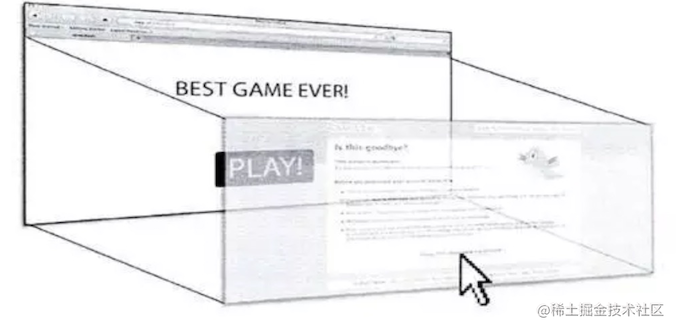

## 前端相关知识整理3——浏览器安全问题

前端安全攻击手段

1. XSS攻击
2. CSRF攻击
3. 点击劫持
4. iframe带来的风险
5. 不安全的第三方依赖包
6. 未加密登录请求
7. 文件上传漏洞

[TOC]

---

### XSS攻击

Cross-Site Scripting（跨站脚本攻击）简称 XSS，是一种**代码注入攻击**。攻击者通过在目标网站上注入恶意脚本，使之在用户的浏览器上运行。利用这些恶意脚本，攻击者可获取用户的敏感信息如 Cookie、Session ID 等，进而危害数据安全。

所以,网页上哪些部分会引起XSS攻击?简单来说,任何可以输入的地方都有可能引起,包括URL!

XSS 常见的注入方法：

+ 在 HTML 中内嵌的文本中，恶意内容以 script 标签形成注入。
+ 在内联的 JavaScript 中，拼接的数据突破了原本的限制（字符串，变量，方法名等）。
+ 在标签属性中，恶意内容包含引号，从而突破属性值的限制，注入其他属性或者标签。
+ 在标签的 `href`、`src` 等属性中，包含 `javascript:` (伪协议)等可执行代码。
+ 在 `onload`、`onerror`、`onclick` 等事件中，注入不受控制代码。
+ 在 style 属性和标签中，包含类似 `background-image:url("javascript:...");` 的代码（新版本浏览器已经可以防范）。
+ 在 style 属性和标签中，包含类似 `expression(...)` 的 CSS 表达式代码（新版本浏览器已经可以防范）。

### XSS 攻击的分类

根据攻击的来源，XSS 攻击可分为存储型、反射型和 DOM 型三种。

#### 存储型 XSS

存储型 XSS 的攻击步骤：

1. 攻击者将恶意代码提交到目标网站的数据库中。
2. 用户打开目标网站时，网站服务端将恶意代码从数据库取出，拼接在 HTML 中返回给浏览器。
3. 用户浏览器接收到响应后解析执行，混在其中的恶意代码也被执行。
4. 恶意代码窃取用户数据并发送到攻击者的网站，或者冒充用户的行为，调用目标网站接口执行攻击者指定的操作。

存储型 XSS(又被称为持久性XSS)攻击常见于带有用户保存数据的网站功能，如论坛发帖、商品评论、用户私信等。

它是最危险的一种跨站脚本，相比反射型XSS和DOM型XSS具有更高的隐蔽性，所以危害更大，因为**它不需要用户手动触发**。**任何允许用户存储数据的web程序都可能存在存储型XSS漏洞**，当攻击者提交一段XSS代码后，被服务器端接收并存储，当**所有浏览者访问某个页面时都会被XSS**。

#### 反射型 XSS

反射型 XSS 的攻击步骤：

1. 攻击者构造出特殊的 URL，其中包含恶意代码。
2. 用户打开带有恶意代码的 URL 时，网站服务端将恶意代码从 URL 中取出，拼接在 HTML 中返回给浏览器。
3. 用户浏览器接收到响应后解析执行，混在其中的恶意代码也被执行。
4. 恶意代码窃取用户数据并发送到攻击者的网站，或者冒充用户的行为，调用目标网站接口执行攻击者指定的操作。

反射型 XSS 跟存储型 XSS 的区别是：存储型 XSS 的恶意代码存在数据库里，反射型 XSS 的恶意代码存在 URL 里。

反射型 XSS (也被称为非持久性XSS)漏洞常见于通过 URL 传递参数的功能，如网站搜索、跳转等。

由于需要用户主动打开恶意的 URL 才能生效，攻击者往往会结合多种手段诱导用户点击。

POST 的内容也可以触发反射型 XSS，只不过其触发条件比较苛刻（需要构造表单提交页面，并引导用户点击），所以非常少见。

#### DOM 型 XSS

DOM 型 XSS 的攻击步骤：

1. 攻击者构造出特殊的 URL，其中包含恶意代码。
2. 用户打开带有恶意代码的 URL。
3. 用户浏览器接收到响应后解析执行，前端 JavaScript 取出 URL 中的恶意代码并执行。
4. 恶意代码窃取用户数据并发送到攻击者的网站，或者冒充用户的行为，调用目标网站接口执行攻击者指定的操作。

DOM 型 XSS 跟前两种 XSS 的区别：DOM 型 XSS 攻击中，取出和执行恶意代码由浏览器端完成，属于前端 JavaScript 自身的安全漏洞，而其他两种 XSS 都属于服务端的安全漏洞。

**注意:**
 DOM通常代表在HTML、XHTML和XML中的对象，使用DOM可以允许程序和脚本动态的访问和更新文档的内容、结构和样式。它不需要服务器解析响应的直接参与，触发XSS**靠的是浏览器端的DOM解析**，所以防范**DOM型XSS完全就是前端的责任,必须注意!!!**。

**对比:**

|    类型    |         存储区          |     插入点      |
| :--------: | :---------------------: | :-------------: |
| 存储型XSS  |       后端数据库        |      HTML       |
| 反射型 XSS |           URL           |      HTML       |
| DOM 型 XSS | 后端数据库/前端存储/URL | 前端 JavaScript |

#### 常用防范方法

+ **HTTP Only:** 在 cookie 中设置 `HTTPOnly` 属性后，JS脚本将无法读取到 cookie 信息。

+ **输入过滤:** 一般是用于对于输入格式的检查，例如：邮箱，电话号码，用户名，密码……等，按照规定的格式输入。不仅仅是前端负责，后端也要做相同的过滤检查。因为攻击者完全可以绕过正常的输入流程，直接利用相关接口向服务器发送设置。

+ **转义 HTML:** 如果拼接 HTML 是必要的，就需要对于引号，尖括号，斜杠进行转义,但这还不是很完善.想对 HTML 模板各处插入点进行充分的转义,就需要采用合适的转义库。

  ```javascript
  function escape(str) {
    str = str.replace(/&/g, '&amp;')
    str = str.replace(/</g, '&lt;')
    str = str.replace(/>/g, '&gt;')
    str = str.replace(/"/g, '&quto;')
    str = str.replace(/'/g, '&#39;')
    str = str.replace(/`/g, '&#96;')
    str = str.replace(/\//g, '&#x2F;')
    return str
  }
  ```

+ **白名单:** 对于显示富文本来说，不能通过上面的办法来转义所有字符，因为这样会把需要的格式也过滤掉。这种情况通常采用白名单过滤的办法，当然也可以通过黑名单过滤，但是考虑到需要过滤的标签和标签属性实在太多，更加推荐使用白名单的方式。

#### 预防存储型和反射型 XSS 攻击

存储型和反射型 XSS 都是在服务端取出恶意代码后，插入到响应 HTML 里的，攻击者刻意编写的“数据”被内嵌到“代码”中，被浏览器所执行。

预防这两种漏洞，有两种常见做法：

+ 改成纯前端渲染，把代码和数据分隔开。
+ 对 HTML 做充分转义。

HTML转义前面已经说过,这里仅仅谈谈纯前端渲染

**纯前端渲染的过程：**

1. 浏览器先加载一个静态 HTML，此 HTML 中不包含任何跟业务相关的数据。
2. 然后浏览器执行 HTML 中的 JavaScript。
3. JavaScript 通过 Ajax 加载业务数据，调用 DOM API 更新到页面上。

在纯前端渲染中，我们会明确的告诉浏览器：下面要设置的内容是文本（`.innerText`），还是属性（`.setAttribute`），还是样式（`.style`）等等。浏览器不会被轻易的被欺骗，执行预期外的代码了。

但纯前端渲染还需注意避免 DOM 型 XSS 漏洞（例如 `onload` 事件和 `href` 中的 `javascript:xxx` 等，请参考下文”预防 DOM 型 XSS 攻击“部分）。

在很多内部、管理系统中，采用纯前端渲染是非常合适的。但对于性能要求高，或有 `SEO` 需求的页面，我们仍然要面对拼接 HTML 的问题,这时就需要对HTML进行充分的转义。

#### 预防 DOM 型 XSS 攻击

DOM 型 XSS 攻击，实际上就是网站前端 JavaScript代码本身不够严谨，把不可信的数据当作代码执行了。

1. 在使用 `.innerHTML`、`.outerHTML`、`document.write()` 时要特别小心，不要把不可信的数据作为 HTML 插到页面上，而应尽量使用 `.textContent`、`.setAttribute()` 等。
2. 如果用 Vue/React 技术栈，并且不使用 `v-html`/`dangerouslySetInnerHTML` 功能，就在前端 render 阶段避免 `innerHTML`、`outerHTML` 的 XSS 隐患。
3. DOM 中的内联事件监听器，如 `location`、`onclick`、`onerror`、`onload`、`onmouseover` 等，标签的 `href` 属性，JavaScript 的 `eval()`、`setTimeout()`、`setInterval()` 等，都能把字符串作为代码运行。如果不可信的数据拼接到字符串中传递给这些 API，很容易产生安全隐患，请务必避免。
4. HTTP Only cookie
5. 对产品输入要求格式严谨检查过滤

```html
<!-- 内联事件监听器中包含恶意代码 -->


<!-- 链接内包含恶意代码 -->
<a href="UNTRUSTED">1</a>

<script>
// setTimeout()/setInterval() 中调用恶意代码
setTimeout("UNTRUSTED")
setInterval("UNTRUSTED")

// location 调用恶意代码
location.href = 'UNTRUSTED'

// eval() 中调用恶意代码
eval("UNTRUSTED")
</script>
```

| XSS 安全漏洞      | 简单转义是否有防护作用 |
| ----------------- | ---------------------- |
| HTML 标签文字内容 | 有                     |
| HTML 属性值       | 有                     |
| CSS 内联样式      | 无                     |
| 内联 JavaScript   | 无                     |
| 内联 JSON         | 无                     |
| 跳转链接          | 无                     |

所以要完善 XSS 防护措施，我们要使用更完善更细致的转义策略。

### 其他 XSS 防范措施

虽然在渲染页面和执行 JavaScript 时，通过谨慎的转义可以防止 XSS 的发生，但完全依靠开发的谨慎仍然是不够的。以下介绍一些通用的方案，可以降低 XSS 带来的风险和后果。

#### Content Security Policy (内容安全策略)

严格的 CSP 在 XSS 的防范中可以起到以下的作用：

+ 禁止加载外域代码，防止复杂的攻击逻辑。
+ 禁止外域提交，网站被攻击后，用户的数据不会泄露到外域。
+ 禁止内联脚本执行（规则较严格，目前发现 GitHub 使用）。
+ 禁止未授权的脚本执行（新特性，Google Map 移动版在使用）。
+ 合理使用上报可以及时发现 XSS，利于尽快修复问题。

关于 CSP 的详情，请关注前端安全系列后续的文章。

#### 输入内容长度控制

对于不受信任的输入，都应该限定一个合理的长度。虽然无法完全防止 XSS 发生，但可以增加 XSS 攻击的难度。

#### 其他安全措施

+ HTTP-only Cookie: 禁止 JavaScript 读取某些敏感 Cookie，攻击者完成 XSS 注入后也无法窃取此 Cookie。
+ 验证码：防止脚本冒充用户提交危险操作。

## XSS 攻击的总结

+ XSS 防范是后端 RD 的责任，后端 RD 应该在所有用户提交数据的接口，对敏感字符进行转义，才能进行下一步操作。

> 不正确。因为：
>
> + 防范存储型和反射型 XSS 是后端 RD 的责任。而 DOM 型 XSS 攻击不发生在后端，是前端 RD 的责任。防范 XSS 是需要后端 RD 和前端 RD 共同参与的系统工程。
> + 转义应该在输出 HTML 时进行，而不是在提交用户输入时。

+ 所有要插入到页面上的数据，都要通过一个敏感字符过滤函数的转义，过滤掉通用的敏感字符后，就可以插入到页面中。

> 不正确。
>
> 不同的上下文，如 HTML 属性、HTML 文字内容、HTML 注释、跳转链接、内联 JavaScript 字符串、内联 CSS 样式表等，所需要的转义规则不一致。 业务 RD 需要选取合适的转义库，并针对不同的上下文调用不同的转义规则。

整体的 XSS 防范是非常复杂和繁琐的，我们不仅需要在全部需要转义的位置，对数据进行对应的转义。而且要防止多余和错误的转义，避免正常的用户输入出现乱码。

虽然很难通过技术手段完全避免 XSS，但我们可以总结以下原则减少漏洞的产生：

+ **利用模板引擎** 开启模板引擎自带的 HTML 转义功能。例如： 在 `ejs` 中，尽量使用 `<%= data %>` 而不是 `<%- data %>`； 在` doT.js` 中，尽量使用 `{{! data }` 而不是 `{{= data }`； 在 `FreeMarker` 中，确保引擎版本高于 2.3.24，并且选择正确的 `freemarker.core.OutputFormat`。
+ **避免内联事件** 尽量不要使用 `onLoad="onload('{{data}}')"`、`onClick="go('{{action}}')"` 这种拼接内联事件的写法。在 JavaScript 中通过 `.addEventlistener()` 事件绑定会更安全。
+ **避免拼接 HTML** 前端采用拼接 HTML 的方法比较危险，如果框架允许，使用 `createElement`、`setAttribute` 之类的方法实现。或者采用比较成熟的渲染框架，如 Vue/React 等。
+ **时刻保持警惕** 在插入位置为 DOM 属性、链接等位置时，要打起精神，严加防范。
+ **增加攻击难度，降低攻击后果** 通过 CSP、输入长度配置、接口安全措施等方法，增加攻击的难度，降低攻击的后果。
+ **主动检测和发现** 可使用 XSS 攻击字符串和自动扫描工具寻找潜在的 XSS 漏洞。


---

## CSRF 跨站点请求伪造

### 什么是 CSRF

跨站请求伪造（英语：Cross-site request forgery），也被称为 one-click attack 或者 session riding，通常缩写为 CSRF 或者 XSRF， 是一种挟制用户在当前已登录的 Web 应用程序上执行非本意的操作的攻击方法。如:攻击者诱导受害者进入第三方网站，在第三方网站中，向被攻击网站发送跨站请求。利用受害者在被攻击网站已经获取的注册凭证，绕过后台的用户验证，达到冒充用户对被攻击的网站执行某项操作的目的。

### CSRF攻击流程

下图引自[浅谈CSRF攻击方式](https://www.cnblogs.com/hyddd/archive/2009/04/09/1432744.html)。


从上图可以看出，要完成一次CSRF攻击，受害者必须依次完成两个步骤：

1. 登录受信任网站A，并在本地生成Cookie。
2. 在不登出A的情况下，访问危险网站B。

看到这里，你也许会说：“如果我不满足以上两个条件中的一个，我就不会受到CSRF的攻击”。是的，确实如此，但你不能保证以下情况不会发生：

1. 你不能保证你登录了一个网站后，不再打开一个tab页面并访问另外的网站。
2. **你不能保证你关闭浏览器了后，你本地的Cookie立刻过期**，你上次的会话已经结束。（事实上，关闭浏览器不能结束一个会话，但大多数人都会错误的认为关闭浏览器就等于退出登录/结束会话了......）
3. 上图中所谓的攻击网站，可能是一个存在其他漏洞的可信任的经常被人访问的网站。

### 常见的CSRF攻击类型

#### GET类型的CSRF

GET类型的CSRF利用非常简单，只需要一个HTTP请求，一般会这样利用：

```html
 
```

在受害者访问含有这个img的页面后，浏览器会自动向`http://bank.example/withdraw?account=xiaoming&amount=10000&for=hacker`发出一次HTTP请求。`bank.example`就会收到包含受害者登录信息的一次跨域请求。

####  POST类型的CSRF

这种类型的CSRF利用起来通常使用的是一个自动提交的表单，如：

```html
 <form action="http://bank.example/withdraw" method=POST>
    <input type="hidden" name="account" value="xiaoming" />
    <input type="hidden" name="amount" value="10000" />
    <input type="hidden" name="for" value="hacker" />
</form>
<script> document.forms[0].submit(); </script> 
```

访问该页面后，表单会自动提交，相当于模拟用户完成了一次POST操作。

POST类型的攻击通常比GET要求更加严格一点，但仍并不复杂。任何个人网站、博客，被黑客上传页面的网站都有可能是发起攻击的来源，**后端接口不能将安全寄托在仅允许POST上面**。

#### 链接类型的CSRF

链接类型的CSRF并不常见，比起其他两种用户打开页面就中招的情况，这种需要用户点击链接才会触发。这种类型通常是在论坛中发布的图片中嵌入恶意链接，或者以广告的形式诱导用户中招，攻击者通常会以比较夸张的词语诱骗用户点击，例如：

```html
  <a href="http://test.com/csrf/withdraw.php?amount=1000&for=hacker" taget="_blank">
  重磅消息！！
  <a/>
```

### CSRF的特点

+ 攻击一般发起在第三方网站，而不是被攻击的网站。被攻击的网站无法防止攻击发生。
+ 攻击**利用受害者在被攻击网站的登录凭证，冒充受害者提交操作**；而不是直接窃取数据。
+ 整个过程攻击者并不能获取到受害者的登录凭证，仅仅是“冒用”。
+ 跨站请求可以用各种方式：图片URL、超链接、CORS、Form提交等等。部分请求方式可以直接嵌入在第三方论坛、文章中，难以进行追踪。

CSRF通常是跨域的，因为外域通常更容易被攻击者掌控。但是如果本域下有容易被利用的功能，比如**可以发图和链接的论坛和评论区，攻击可以直接在本域下进行，而且这种攻击更加危险。**

### CSRF与 XSS 区别

+ **通常来说 CSRF 是由 XSS 实现的，CSRF 时常也被称为 XSRF（CSRF 实现的方式还可以是直接通过命令行发起请求等）。**

+ 本质上讲，**XSS 是代码注入问题**，**CSRF 是 HTTP 问题。**

  ==**XSS 是内容没有过滤导致浏览器将攻击者的输入当代码执行**==

  ==**CSRF 则是因为浏览器在发送 HTTP 请求时候自动带上 cookie，**==而一般网站的 session 都存在 cookie里面(Token验证可以避免)

### 防御

+ 验证码

  强制用户必须与应用进行交互，才能完成最终请求。此种方式能很好的遏制 `csrf`，但是用户体验比较差。

+ `Referer check` (请求来源限制)

  此种方法成本最低，但是并不能保证 100% 有效，因为服务器并不是什么时候都能取到 `Referer`，而且低版本的浏览器存在伪造 `Referer` 的风险。

  origin header : ie 11,302

  defer header : ie6/7,https->http,js打开页面

+ Token

  **Token 验证的 CSRF 防御机制是公认最合适的方案。若网站同时存在 XSS 漏洞的时候，这个方法也是空谈。**

+ 双重Cookies

  利用CSRF攻击不能获取到用户Cookie的特点，我们可以要求Ajax和表单请求携带一个Cookie中的值。

  双重Cookies采用以下流程：

  + 在用户访问网站页面时，向请求域名注入一个Cookie，内容为随机字符串（例如`csrfcookie=v8g9e4ksfhw`）。
  + 在前端向后端发起请求时，取出Cookie，并添加到URL的参数中（接上例`POST https://www.a.com/comment?csrfcookie=v8g9e4ksfhw`）。
  + 后端接口验证Cookie中的字段与URL参数中的字段是否一致，不一致则拒绝。

  此方法相对于CSRF Token就简单了许多。可以直接通过前后端拦截的的方法自动化实现。后端校验也更加方便，只需进行请求中字段的对比，而不需要再进行查询和存储Token。

+ **`SamesiteCookie`**

  为了从源头上解决这个问题，Google起草了一份草案来改进HTTP协议，那就是为Set-Cookie响应头新增`Samesite`属性，它用来标明这个 Cookie是个“同站 Cookie”，同站Cookie只能作为第一方Cookie，不能作为第三方Cookie，`Samesite` 有两个属性值，分别是 Strict 和 Lax，下面分别讲解：

  + **`Samesite=Strict`**

  这种称为严格模式，表明这个 Cookie 在任何情况下都不可能作为第三方 Cookie，绝无例外。

  + **`Samesite=Lax`**

  这种称为宽松模式，比 Strict 放宽了点限制：假如这个请求是这种请求（改变了当前页面或者打开了新页面）且同时是个GET请求，则这个Cookie可以作为第三方Cookie。

  **存在问题：**

  + 如果`SamesiteCookie`被设置为**Strict**，浏览器**在任何跨域请求中都不会携带Cookie，新标签重新打开也不携带**，所以说CSRF攻击基本没有机会。

    但是跳转子域名或者是新标签重新打开刚登陆的网站，之前的Cookie都不会存在。尤其是有登录的网站，那么我们新打开一个标签进入，或者跳转到子域名的网站，都需要重新登录。对于用户来讲，可能体验不会很好。

  + 如果`SamesiteCookie`被设置为**Lax**，那么**其他网站通过页面跳转过来的时候可以使用Cookie**，可以保障外域连接打开页面时用户的登录状态。但相应的，其安全性也比较低。

  + **兼容性**不是很好，现阶段除了从新版Chrome和Firefox支持以外，Safari以及IOS Safari都还不支持，现阶段看来暂时还不能普及。

  + **不支持子域**

    例如，种在`topic.a.com`下的Cookie，并不能使用`a.com`下种植的`SamesiteCookie`。这就导致了当我们网站有多个子域名时，不能使用`SamesiteCookie`在主域名存储用户登录信息。每个子域名都需要用户重新登录一次。

---

## 点击劫持

点击劫持是一种视觉上的欺骗手段。攻击者使用一个透明的、不可见的iframe，覆盖在一个网页上，然后诱使用户在网页上进行操作，此时用户将在不知情的情况下点击透明的iframe页面。通过调整iframe页面的位置，可以诱使用户恰好点击在iframe页面的一些功能性按钮上。



一个简单的点击劫持例子，就是当你点击了一个不明链接之后，自动关注了某一个人的博客或者订阅了视频

### 点击劫持防御

1. **X-Frame-Options浏览器机制：**`X-Frame-Options` HTTP响应头是用来给浏览器指示允许一个页面能否在`<frame>`、`<iframe>`、`<object>`中展现的标记，有三个可选的值：

   + **DENY**：浏览器会拒绝当前页面加载任何frame页面（即使是相同域名的页面也不允许）
   + **SAME-ORIGIN**：允许加载frame页面，但是frame页面的地址只能为同源域名下的页面
   + **ALLOW-FROM：**可以加载指定来源的frame页面（可以定义frame页面的地址）但这个缺陷就是chrome、Safari是不支持`ALLOW-FROM`语法！

2. **使用认证码认证用户：**点击劫持漏洞通过伪造网站界面进行攻击，网站开发人员可以通过认证码识别用户，确定是用户发出的点击命令才执行相应操作。识别用户的方法中最有效的方法是认证码认证。

   例如，在网站上广泛存在的发帖认证码，要求用户输入图形中的字符，输入某些图形的特征等

3. **使用** `FrameBusting` **代码：**使用 JavaScript 脚本阻止恶意网站载入网页。如果检测到网页被非法网页载入，就执行自动跳转功能。如果用户浏览器禁用JavaScript脚本，那么Frame Busting代码也无法正常运行。所以，该类代码只能提供部分保障功能

---

## iframe 带来的风险

有些时候我们的前端页面需要用到第三方提供的页面组件，通常会以iframe的方式引入。典型的例子是使用iframe在页面上添加第三方提供的广告、天气预报、社交分享插件等等

iframe本身不受我们控制，那么如果iframe中的域名因为过期而被恶意攻击者抢注，或者第三方被黑客攻破，iframe中的内容被替换掉了，从而利用用户浏览器中的安全漏洞下载安装木马、恶意勒索软件等等，这问题可就大了

### iframe防御

iframe有了一个叫做sandbox的安全属性，通过它可以对iframe的行为进行各种限制，在 iframe 元素中添加上这个关键词就行，另外，sandbox也提供了丰富的配置参数，我们可以进行较为细粒度的控制。一些典型的参数如下：

**allow-forms：**允许iframe中提交form表单 

**allow-popups：**允许iframe中弹出新的窗口或者标签页（例如，`window.open()`，`showModalDialog()`，`target=”_blank”`等等）

**allow-scripts：**允许iframe中执行JavaScript

**allow-same-origin：**允许iframe中的网页开启同源策略

如果你只是添加上这个属性而保持属性值为空，那么浏览器将会对 iframe 实施史上最严厉的调控限制

---

## 不安全的第三方依赖

项目里面使用了很多第三方的依赖，不论应用自己的代码的安全性有多高，如果这些来自第三方的代码有安全漏洞，那么对应用整体的安全性依然会造成严峻的挑战。jQuery就存在多个已知安全漏洞，Node.js也有一些已知的安全漏洞

**第三方依赖包防御**

手动检查这些第三方代码有没有安全问题是个苦差事，主要是因为应用依赖的这些组件数量众多，手工检查太耗时，有自动化的工具可以使用，比如NSP(Node Security Platform)，Snyk、sonarQubej检测工具等等

---

## 未加密登录请求

由于Web配置不安全，登陆请求把诸如用户名和密码等敏感字段未加密进行传输，攻击者可以窃听网络以劫获这些敏感信息。建议使用 `crypto` 等加密库加密后再传输。

---

## 文件上传漏洞

文件上传漏洞通常由于网页代码中的文件上传路径变量过滤不严造成的，如果文件上传功能实现代码**没有严格限制**用户上传的**文件后缀**以及**文件类型**，攻击者可通过 Web 访问的目录上传任意文件，包括网站后门文件（web-shell），进而远程控制网站服务器。
因此，在开发网站及应用程序过程中，需严格限制和校验上传的文件，禁止上传恶意代码的文件。同时限制相关目录的执行权限，防范web-shell攻击。

严格管理所有的上传接口，防止任何预期之外的上传内容（例如HTML）。
添加Header `X-Content-Type-Options: nosniff` 防止黑客上传HTML内容的资源（例如图片）被解析为网页。
对于用户上传的图片，进行转存或者校验。不要直接使用用户填写的图片链接。

---

## 其他攻击方式

当然还存在很多别的攻击手段，比如：

HTTPS 也可能存在的风险（强制让HTTPS降级回HTTP，从而继续进行中间人攻击）

本地存储数据泄露（尽可能不在前端存储任何敏感、机密的数据）

---

##  Vue框架的安全性

+ HTML内容、属性内容 自动转义
+ 避免服务端模版注入

---

##  参考资料

+ [前端面试查漏补缺--(七) XSS攻击与CSRF攻击](https://juejin.im/post/6844903781704925191)

+ [web前端安全攻击与防御](https://juejin.im/post/6844904089201934350)

+ [Vue.js 安全性](https://vuejs.org/v2/guide/security.html)

+ [前端安全系列（一）：如何防止XSS攻击？](https://juejin.im/post/6844903685122703367)

+ [前端安全系列之二：如何防止CSRF攻击？](https://juejin.im/post/6844903689702866952)

  

