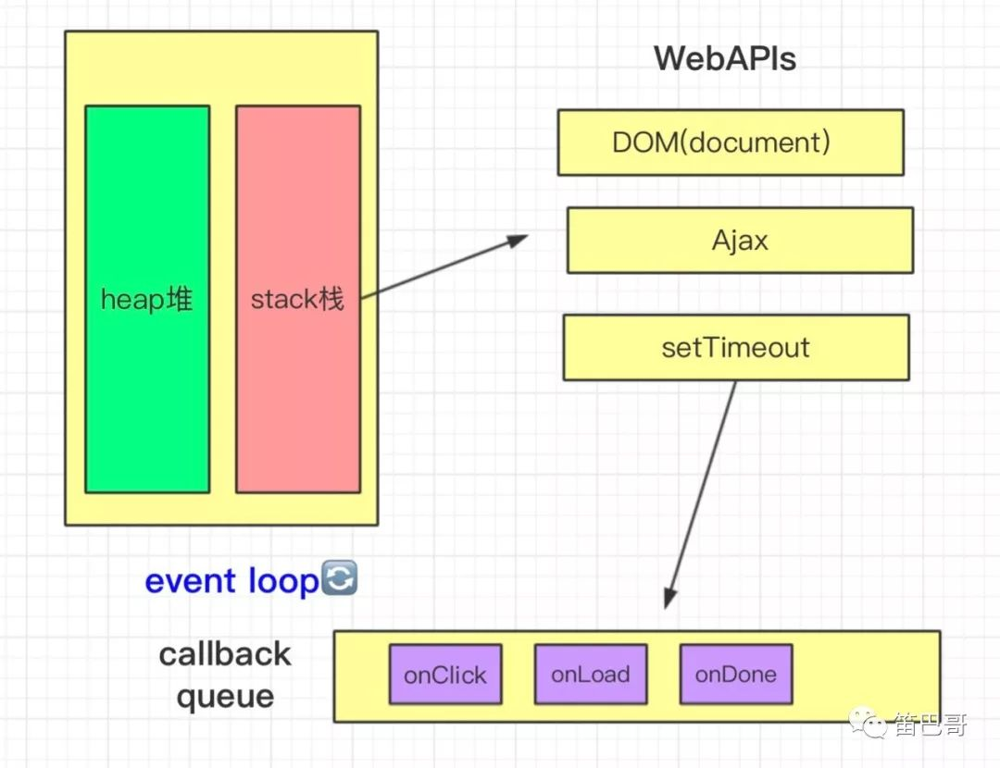

## 前端相关知识整理5——Event Loop

## 相关说明

由于对于JavaScript的实现，各平台是根据 `ECMAScript` 进行实现的，具体的理解及实现是有差异的。

此处主要以浏览器环境为基础来学习 Event Loop。

### 浏览器结构

+ 用户主界面
+ 主进程
+ 内核
  + 渲染引擎
  + JS引擎
    + 执行栈
  + 事件触发线程
    + 消息队列
      + 微任务
      + 宏任务
  + 网络异步线程
  + 定时器线程


### 事件循环

JavaScript 是典型的单线程单并发语言，即表示在同一时间片内其只能执行单个任务或者部分代码片。换言之，我们可以认为某个同域浏览器上下中 JavaScript 主线程拥有一个函数调用栈以及一个任务队列；主线程会依次执行代码，当遇到函数时，会先将函数入栈，函数运行完毕后再将该函数出栈，直到所有代码执行完毕。当函数调用栈为空时，运行时即会根据事件循环（Event Loop）机制来从任务队列中提取出待执行的回调并执行，执行的过程同样会进行函数帧的入栈出栈操作。每个线程有自己的事件循环，所以每个 Web Worker有自己的，所以它才可以独立执行。然而，所有同属一个 origin 的窗体都共享一个事件循环，所以它们可以同步交流。

Event Loop（事件循环）并不是 JavaScript 中独有的，其广泛应用于各个领域的异步编程实现中；所谓的 Event Loop 即是一系列回调函数的集合，在执行某个异步函数时，会将其回调压入队列中，JavaScript 引擎会在异步代码执行完毕后开始处理其关联的回调。

**事件循环**是指：执行==一个==宏任务，然后执行==清空==微任务队列，循环再执行一个宏任务，在清空微任务队列

+ **宏任务 (`macrotask(task)`) ：** `setTimeout`、`setInterval`、`setImmediate`、`Promise`、`script`、`IO`、`UI Rendering`、`requestAnimationFrame`
+ **微任务 (`microtask(jobs)`)：**  `Promise.then()/catch()/finally()`、`ajax`、`Object.observe(已废弃)`、`process.nextTick`、`MutationObserver(html5新特性)`

在 Web 开发中，我们常常会需要处理网络请求等相对较慢的操作，如果将这些操作全部以同步阻塞方式运行无疑会大大降低用户界面的体验。另一方面，我们点击某些按钮之后的响应事件可能会导致界面重渲染，如果因为响应事件的执行而阻塞了界面的渲染，同样会影响整体性能。实际开发中我们会采用异步回调来处理这些操作，这种调用者与响应之间的解耦保证了 JavaScript 能够在等待异步操作完成之前仍然能够执行其他的代码。Event Loop 正是负责执行队列中的回调并且将其压入到函数调用栈中。

当在执行过程中遇到一异步操作的时候，会交给浏览器的其他模块进行处理，当到达执行状态之后，task(回调函数)会放入到任务队列之中。一般不同的异步任务的回调函数会放入不同的任务队列之中。等到调用栈中所有task执行完毕之后，接着去执行任务队列之中的task(回调函数)。


```javascript
console.log('start')

setTimeout(function() {
    console.log('timeout')
}, 0)

new Promise(function(resolve) {
    console.log('promise')
    resolve()
}).then(function() {
    console.log('promise resolved')
})

console.log('end')
```


```javascript
console.log('第一次循环主执行栈开始')

setTimeout(function() {
    console.log('第二次循环开始，宏任务队列的第一个宏任务执行中')
    new Promise(function(resolve) {
        console.log('宏任务队列的第一个宏任务的微任务继续执行')
        resolve()
    }).then(function() {
        console.log('第二次循环的微任务队列的微任务执行')
    })
}, 0)

new Promise(function(resolve) {
    console.log('第一次循环主执行栈进行中...')
    resolve()
}).then(function() {
    console.log('第一次循环微任务，第一次循环结束')
    setTimeout(function() {
        console.log('第二次循环的宏任务队列的第二个宏任务执行')
    })
})

console.log('第一次循环主执行栈完成')
```


```javascript
// 测试代码
console.log('main1');

// 该函数仅在 Node.js 环境下可以使用
process.nextTick(function() {
    console.log('process.nextTick1');
});

setTimeout(function() {
    console.log('setTimeout');
    process.nextTick(function() {
        console.log('process.nextTick2');
    });
}, 0);

new Promise(function(resolve, reject) {
    console.log('promise');
    resolve();
}).then(function() {
    console.log('promise then');
});

console.log('main2');

/** 执行结果
 * main1
 * promise
 * main2
 * process.nextTick1
 * promise then
 * setTimeout
 * process.nextTick2
 */
```




从上图中我们可以看到，在主线程运行时，会产生**堆(heap)**和**栈(stack)**。

**堆**中存的是我们声明的object类型的数据

**栈**中存的是基本数据类型以及函数执行时的运行空间。

**栈**中的代码会调用各种外部API，它们在任务队列中加入各种事件(onClick,onLoad,onDone)，只要栈中的代码执行完毕(js引擎存在monitoring process进程，会持续不断的检查主线程执行栈是否为空)，主线程就回去读取任务队列，在按顺序执行这些事件对应的回调函数。

也就是说主线程从任务队列中读取事件，这个过程是循环不断的，所以这种运行机制又成为Event Loop(事件循环)。


## 总结


+ 所有的代码都要通过函数调用栈中调用执行。
+ 当遇到前文中提到的 `APIs` 的时候，会交给浏览器内核的其他模块进行处理。
+ 任务队列中存放的是回调函数。
+ 等到调用栈中的task执行完之后再回去执行任务队列之中的task。
+ 不同的任务会放进不同的任务队列之中。
  + 先执行macro-task，等到函数调用栈清空之后再执行所有在队列之中的micro-task。
  + 等到所有micro-task执行完之后再从macro-task中的一个任务队列开始执行，就这样一直循环。
  + 当有多个macro-task(micro-task)队列时，事件循环的顺序是按上文macro-task(micro-task)的分类中书写的顺序执行的。

---

##  参考资料

+ [JavaScript Event Loop 机制详解与 Vue.js 中实践应用](https://zhuanlan.zhihu.com/p/29116364)
+ [深入浅出JavaScript事件循环机制(上)](https://zhuanlan.zhihu.com/p/26229293)
+ [深入浅出JavaScript事件循环机制(下)](https://zhuanlan.zhihu.com/p/26238030)
+ [今天，我明白了JS事件循环机制](https://zhuanlan.zhihu.com/p/75572565)
+ 

